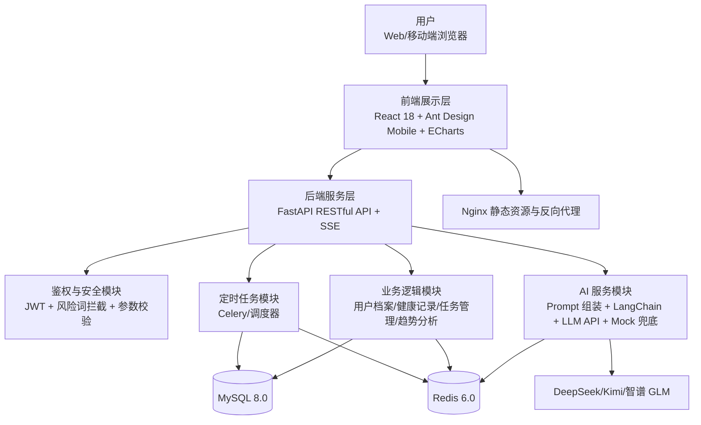
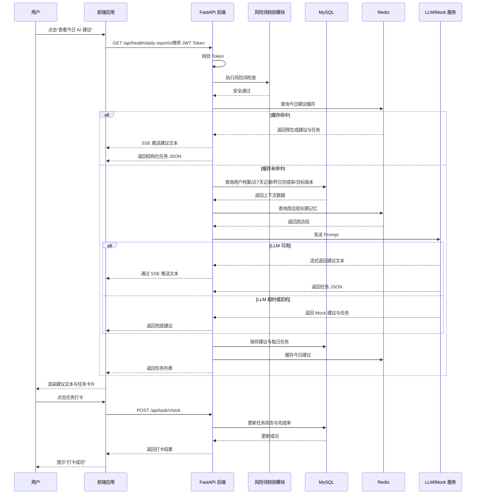
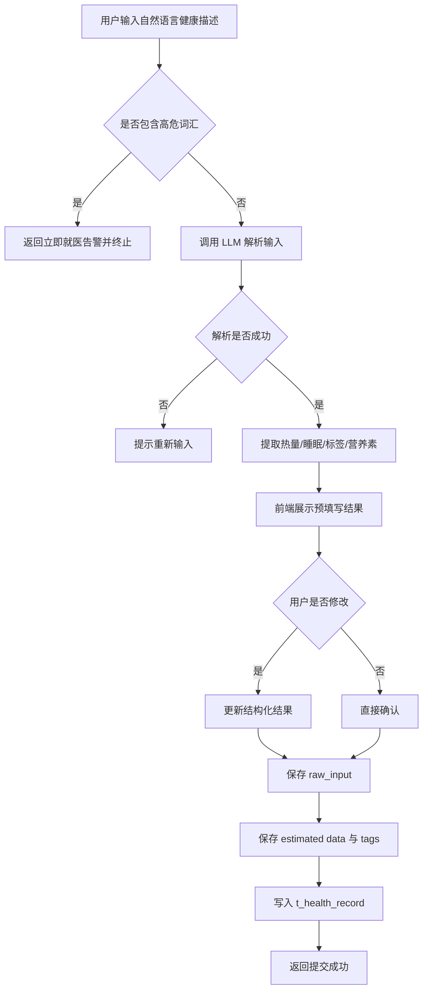
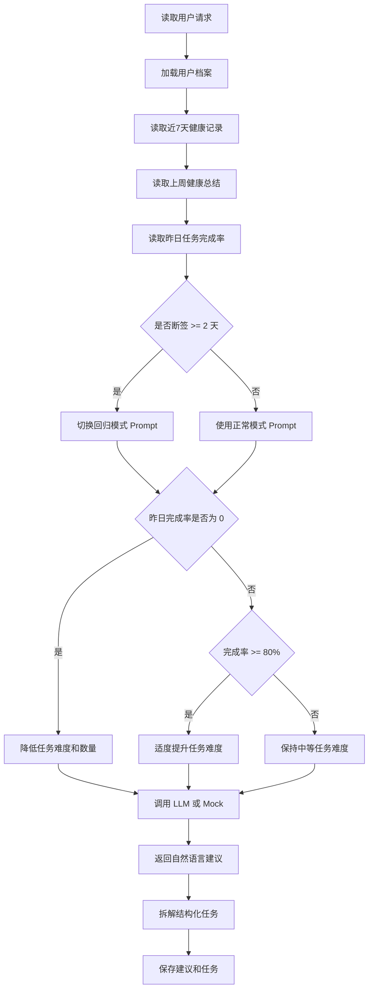
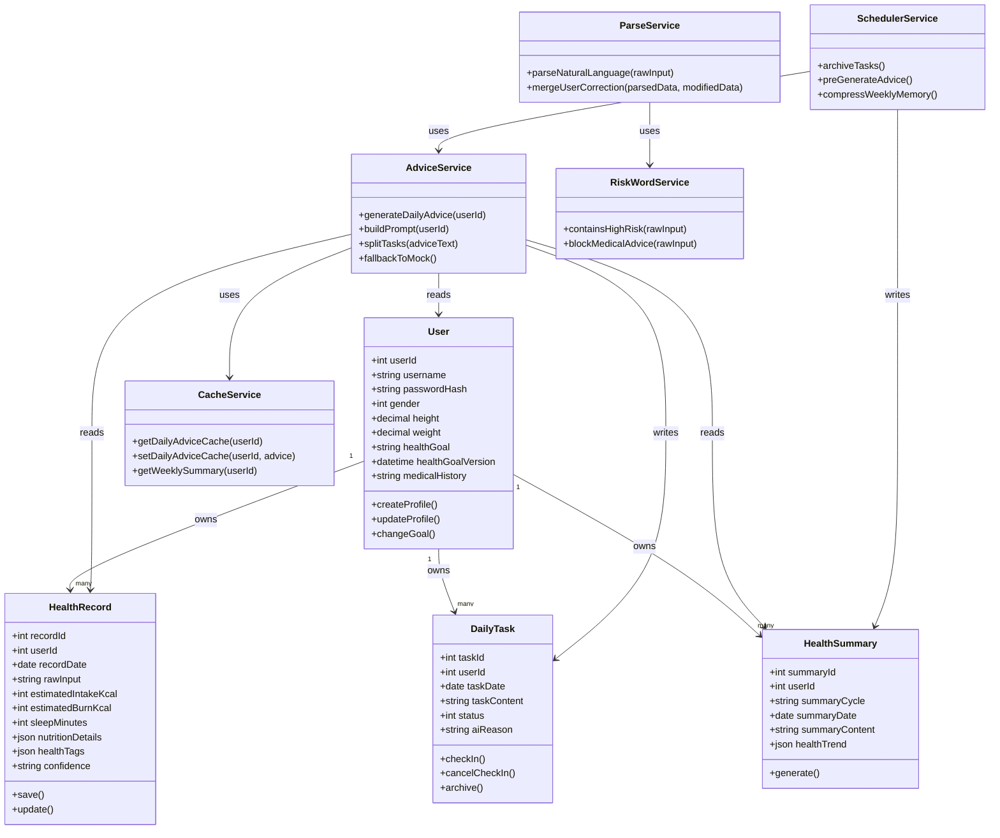

# 武汉大学计算机学院本科生课程设计报告

## HealthMate 健康伴侣系统设计说明书

专业：计算机弘毅班  
课程：计算机综合项目实践  
指导教师：谭小琼  
团队名称：token  
团队成员：周炜、黎宇恒  
完成日期：2026 年 3 月

---

## 1. 引言

### 1.1 编写目的

本文档基于《基于大语言模型的个人健康智能分析与管理系统》需求规格说明书和《计算机综合项目实践选题及团队组建报告》，对 HealthMate 健康伴侣的系统结构、功能分层、关键流程、算法设计、类设计、接口设计、数据库设计与 UI 设计进行详细说明，为后续编码实现、联调测试、部署运维和课程答辩提供统一依据。

### 1.2 系统定位

HealthMate 是一款面向亚健康人群、健身小白和职场上班族的个人健康智能分析与管理系统。系统围绕“数据记录 - AI 分析 - 任务干预 - 打卡反馈 - 趋势可视化”的闭环展开，使用大语言模型承担模糊输入解析与个性化建议生成能力，但系统定位为非医疗级健康管理工具，不提供疾病诊断和处方。

### 1.3 设计目标

1. 降低健康数据录入门槛，支持自然语言和手动表单两种输入方式。
2. 通过 LLM、RAG 和长期记忆机制生成连续、安全、个性化的健康建议。
3. 将 AI 建议转化为结构化任务，构建可执行、可反馈、可迭代的健康管理闭环。
4. 满足课程项目对工程化开发、前后端分离、数据库建模、接口设计和可部署性的要求。

### 1.4 团队分工

1. 黎宇恒：负责前端 UI/UX、组件开发、数据可视化实现、前后端联调、前端测试与部分部署。
2. 周炜：负责后端 API、MySQL/Redis 设计、AI 模型接入、Prompt 工程、后端测试与部署主导。

---

## 2. 系统体系架构

### 2.1 总体架构设计

系统采用前后端分离架构，并按展示层、业务层、AI 服务层、数据存储层、基础设施层划分。整体架构兼顾课程项目落地性与后续扩展性。



### 2.2 分层说明

#### 2.2.1 前端展示层

前端基于 React 18 开发，负责页面展示、表单校验、图表渲染、SSE 流式建议展示、打卡交互和响应式适配。前端不直接访问数据库，只通过 Axios 调用后端 API。

#### 2.2.2 后端服务层

后端基于 FastAPI 实现，负责请求路由、参数校验、JWT 鉴权、业务流程编排、事务控制和异常处理，并通过 SSE 向前端推送流式建议文本。

#### 2.2.3 AI 服务层

AI 服务层负责：

1. 将自然语言健康记录解析为结构化数据。
2. 组装带约束的 Prompt。
3. 基于用户画像、近期数据、周总结和任务反馈生成个性化建议。
4. 将建议拆解为结构化任务。
5. 在大模型不可用时触发 Mock 兜底。

#### 2.2.4 数据存储层

1. MySQL：存储用户档案、健康记录、每日任务、健康总结等结构化数据。
2. Redis：缓存预生成建议、长期记忆摘要、热点查询结果和部分会话状态。

#### 2.2.5 基础设施层

采用 Docker + Docker Compose 部署，Nginx 负责静态资源托管与反向代理，云服务器提供运行环境。

### 2.3 体系架构特点

1. 前后端分离，职责清晰，便于并行开发。
2. AI 服务独立封装，便于更换模型供应商。
3. 关系数据库与缓存协同使用，兼顾一致性和响应速度。
4. 定时任务独立运行，适合实现建议预生成和长期记忆压缩。
5. 采用风险词拦截和 Prompt 安全约束，控制健康类 AI 应用风险。

---

## 3. 系统功能结构

### 3.1 功能层次结构图

```mermaid
graph TD
    A[HealthMate 健康伴侣] --> B[账号与档案管理模块]
    A --> C[健康数据录入模块]
    A --> D[AI 智能分析与建议模块]
    A --> E[任务目标与打卡模块]
    A --> F[健康数据可视化模块]
    A --> G[系统后台定时任务模块]

    B --> B1[注册]
    B --> B2[登录]
    B --> B3[基础健康档案填写]
    B --> B4[个人信息修改]
    B --> B5[健康目标修改]

    C --> C1[自然语言录入]
    C --> C2[手动表单录入]
    C --> C3[健康数据解析结果修正]
    C --> C4[风险词拦截]
    C --> C5[原始输入保留]

    D --> D1[今日建议生成]
    D --> D2[SSE 流式输出]
    D --> D3[任务结构化拆解]
    D --> D4[长期记忆管理]
    D --> D5[断签回归模式]
    D --> D6[Mock 兜底]

    E --> E1[今日任务展示]
    E --> E2[任务打卡]
    E --> E3[取消打卡]
    E --> E4[完成率统计]
    E --> E5[历史记录查询]

    F --> F1[健康仪表盘]
    F --> F2[周趋势分析]
    F --> F3[月趋势分析]
    F --> F4[健康标签统计]
    F --> F5[异常点标注]

    G --> G1[周记忆压缩]
    G --> G2[次日建议预生成]
    G --> G3[打卡状态归档]
```



### 3.2 功能模块说明

#### 3.2.1 账号与档案管理模块

负责注册、登录、档案填写与目标维护，是系统所有个性化分析能力的输入基础。

#### 3.2.2 健康数据录入模块

负责用户健康数据的采集与结构化，支持模糊自然语言解析和手动精确录入，并保留原始输入。

#### 3.2.3 AI 智能分析与建议模块

负责基于用户画像、近期数据、长期记忆和反馈记录生成个性化建议，并输出结构化任务。

#### 3.2.4 任务目标与打卡模块

负责承接 AI 输出的行动建议，将其转为具体任务，并记录用户执行结果。

#### 3.2.5 健康数据可视化模块

负责基于历史健康记录与任务反馈形成可视化趋势分析与异常识别。

#### 3.2.6 系统后台定时任务模块

负责健康总结生成、建议缓存预生成和历史任务归档，保证系统具备长期连续性。

---

## 4. 系统用例时序图及说明

### 4.1 核心用例选择

选择“获取 AI 今日健康建议并生成打卡任务”作为核心用例，因为该用例覆盖系统的主要业务链路：鉴权、数据读取、缓存命中判断、LLM 调用、SSE 流式返回、任务入库和前端展示。

### 4.2 用例时序图



### 4.3 时序图说明

1. 用户从前端发起建议获取请求，请求必须携带 JWT。
2. 后端先进行鉴权和安全校验，再决定是否继续调用缓存或数据库。
3. 若 Redis 中已有预生成建议，则优先使用缓存，减少实时大模型调用成本。
4. 若缓存未命中，则后端从 MySQL 获取短期数据，并从 Redis 获取长期记忆摘要。
5. 后端将多源数据组装为 Prompt，调用 LLM 或 Mock 服务。
6. 建议文本采用 SSE 持续输出，前端表现为“打字机”效果。
7. 任务 JSON 在生成后落库到每日任务表，为后续打卡提供数据基础。
8. 用户打卡后，后端通过事务更新任务状态与完成率，形成闭环反馈。

---

## 5. 复杂功能算法设计

本系统复杂功能主要集中在“自然语言健康数据解析”和“AI 建议与任务生成”两个模块。

### 5.1 算法一：自然语言健康数据解析与双轨存储

#### 5.1.1 设计目标

将用户输入的模糊健康描述自动解析为结构化健康记录，并允许用户修正，最终以“原始输入 + 结构化数据”的双轨形式存储。

#### 5.1.2 算法流程图



#### 5.1.3 伪代码

```text
function parseHealthInput(userId, rawInput):
    if containsHighRiskWords(rawInput):
        return error("检测到高危症状，请立即就医")

    parsedResult = LLM.parse(rawInput)
    if parsedResult is null or parsedResult.confidence == "low":
        return error("无法识别健康数据，请重新输入")

    previewData = {
        rawInput: rawInput,
        intakeKcal: parsedResult.intakeKcal,
        burnKcal: parsedResult.burnKcal,
        sleepMinutes: parsedResult.sleepMinutes,
        nutritionDetails: parsedResult.nutritionDetails,
        healthTags: parsedResult.healthTags,
        confidence: parsedResult.confidence
    }

    return previewData

function confirmParsedHealthRecord(userId, previewData, userModifiedData):
    finalData = merge(previewData, userModifiedData)
    insert into t_health_record(
        user_id,
        record_date,
        raw_input,
        estimated_intake_kcal,
        estimated_burn_kcal,
        sleep_minutes,
        nutrition_details,
        health_tags,
        confidence
    )
    return success
```

### 5.2 算法二：AI 建议生成与任务难度动态调整

#### 5.2.1 设计目标

结合用户档案、短期数据、长期记忆和昨日反馈，输出具备连续性和安全性的建议，并自动生成适配用户执行能力的任务。

#### 5.2.2 算法流程图



#### 5.2.3 伪代码

```text
function generateDailyAdvice(userId):
    profile = getUserProfile(userId)
    recentRecords = getRecentHealthRecords(userId, 7)
    weeklySummary = getWeeklySummary(userId)
    yesterdayRate = getYesterdayTaskCompletionRate(userId)

    mode = "normal"
    if missingRecordDays(userId) >= 2:
        mode = "return_mode"

    difficulty = "medium"
    taskCount = 2
    if yesterdayRate == 0:
        difficulty = "low"
        taskCount = 1
    else if yesterdayRate >= 0.8:
        difficulty = "high"
        taskCount = 3

    prompt = buildPrompt(
        profile,
        recentRecords,
        weeklySummary,
        yesterdayRate,
        mode,
        difficulty,
        taskCount
    )

    if USE_MOCK_AI == true:
        result = mockAdvice(prompt)
    else:
        result = callLLM(prompt, timeout=5s)
        if result.timeout:
            result = mockAdvice(prompt)

    saveAdvice(userId, result.adviceText)
    saveTasks(userId, result.taskList)
    return result
```

---

## 6. 面向对象方法类图详细设计

### 6.1 类设计思路

系统后端采用分层面向对象设计。核心对象包括用户、健康记录、每日任务、健康总结、建议生成器、风险词校验器、缓存管理器和任务调度器。

### 6.2 核心类图



### 6.3 主要类职责说明

#### 6.3.1 User

负责管理用户身份与健康档案，包括注册登录后的基础画像信息维护。

#### 6.3.2 HealthRecord

负责封装健康数据记录实体，既保存结构化数值，也保存原始输入文本。

#### 6.3.3 DailyTask

负责管理 AI 生成任务及其打卡状态变化，是健康闭环中的执行载体。

#### 6.3.4 HealthSummary

负责对用户周/月健康信息进行压缩总结，为长期记忆提供支持。

#### 6.3.5 AdviceService

是系统核心服务类，负责 Prompt 组装、模型调用、任务拆解和 Mock 兜底。

#### 6.3.6 ParseService

负责自然语言录入解析和用户修正结果合并。

#### 6.3.7 RiskWordService

负责检测输入内容中的高危症状，防止系统越界输出医疗建议。

#### 6.3.8 CacheService

负责管理 Redis 中的建议缓存和长期记忆缓存。

#### 6.3.9 SchedulerService

负责定时调度的三项核心任务：任务归档、建议预生成、记忆压缩。

---

## 7. 接口设计

### 7.1 设计原则

1. 遵循 RESTful 风格。
2. 使用 JSON 作为主要数据交换格式。
3. 所有业务接口除注册、登录外均要求 JWT 鉴权。
4. 统一响应格式，便于前后端联调。

### 7.2 统一响应格式

```json
{
  "code": 0,
  "message": "success",
  "data": {}
}
```

其中：

1. `code = 0` 表示成功。
2. `code != 0` 表示业务失败。
3. `message` 为中文错误或成功说明。
4. `data` 为具体业务数据。

### 7.3 核心接口清单

#### 7.3.1 注册接口

- 接口地址：`POST /api/auth/register`
- 功能说明：用户注册

请求示例：

```json
{
  "username": "healthmate001",
  "password": "health123",
  "confirmPassword": "health123"
}
```

响应示例：

```json
{
  "code": 0,
  "message": "注册成功",
  "data": {
    "userId": 1
  }
}
```

#### 7.3.2 登录接口

- 接口地址：`POST /api/auth/login`
- 功能说明：账号密码登录并返回 JWT

响应数据：

```json
{
  "code": 0,
  "message": "登录成功",
  "data": {
    "token": "jwt-token",
    "expireAt": "2026-03-24T22:30:00"
  }
}
```

#### 7.3.3 保存基础档案接口

- 接口地址：`POST /api/user/profile`
- 功能说明：保存或更新用户基础健康档案

请求参数：

```json
{
  "gender": 1,
  "height": 172,
  "weight": 67,
  "healthGoal": "改善睡眠",
  "medicalHistory": "轻度过敏，无重大病史"
}
```

#### 7.3.4 自然语言解析接口

- 接口地址：`POST /api/health/parse`
- 功能说明：将自然语言健康输入转换为结构化结果

请求示例：

```json
{
  "rawInput": "跑了40分钟，吃了一个苹果，睡了7小时"
}
```

响应示例：

```json
{
  "code": 0,
  "message": "解析成功",
  "data": {
    "estimatedIntakeKcal": 95,
    "estimatedBurnKcal": 280,
    "sleepMinutes": 420,
    "healthTags": ["有氧", "低糖饮食", "睡眠正常"],
    "nutritionDetails": {
      "carbs_g": 25,
      "protein_g": 1,
      "fat_g": 0
    },
    "confidence": "high"
  }
}
```

#### 7.3.5 健康记录提交接口

- 接口地址：`POST /api/health/record`
- 功能说明：提交用户确认后的健康记录

#### 7.3.6 获取今日建议接口

- 接口地址：`GET /api/health/daily-report`
- 功能说明：获取今日 AI 建议
- 返回方式：SSE + 任务 JSON

SSE 文本事件：

```text
event: message
data: 今天建议你优先修复睡眠节律...
```

任务结果示例：

```json
{
  "tasks": [
    {
      "taskId": 101,
      "taskContent": "23:30 前入睡",
      "aiReason": "近3天睡眠时长偏低"
    },
    {
      "taskId": 102,
      "taskContent": "晚饭后快走20分钟",
      "aiReason": "帮助提升当日消耗并稳定血糖"
    }
  ]
}
```

#### 7.3.7 任务打卡接口

- 接口地址：`POST /api/task/check`
- 功能说明：任务打卡

请求示例：

```json
{
  "taskId": 101,
  "status": 1
}
```

#### 7.3.8 获取趋势图数据接口

- 接口地址：`GET /api/health/trend?dimension=week`
- 功能说明：返回周/月趋势分析数据

#### 7.3.9 获取历史任务接口

- 接口地址：`GET /api/task/history?date=2026-03-24`
- 功能说明：查看指定日期任务历史

### 7.4 接口安全设计

1. 使用 `Authorization: Bearer <token>` 传递 JWT。
2. 登录密码使用 bcrypt 存储，接口层不返回明文信息。
3. 对用户文本输入进行长度、格式与敏感词校验。
4. AI 调用前对用户身份类信息脱敏，不向大模型发送用户名、学号、手机号等信息。

---

## 8. 数据库物理设计

### 8.1 数据库选型

系统选用 MySQL 8.0 作为主数据库，选型理由如下：

1. 支持事务，适合任务打卡等一致性要求较高的业务。
2. 支持 JSON 字段，适合营养素与健康标签的灵活扩展。
3. 与 SQLAlchemy 配合良好，便于工程实现。

### 8.2 数据库表结构设计

#### 8.2.1 用户表 `t_user`

| 字段名 | 类型 | 约束 | 说明 |
|---|---|---|---|
| user_id | INT | PK, AUTO_INCREMENT | 用户主键 |
| username | VARCHAR(50) | UNIQUE, NOT NULL | 登录用户名 |
| password_hash | VARCHAR(255) | NOT NULL | bcrypt 哈希密码 |
| gender | TINYINT | NULL | 0 未知 / 1 男 / 2 女 |
| height | DECIMAL(5,2) | NULL | 身高 cm |
| weight | DECIMAL(5,2) | NULL | 体重 kg |
| health_goal | VARCHAR(50) | NOT NULL | 当前健康目标 |
| health_goal_version | DATETIME | NOT NULL | 目标最后变更时间 |
| medical_history | VARCHAR(255) | NULL | 伤病史/过敏史 |
| created_at | DATETIME | NOT NULL | 创建时间 |
| updated_at | DATETIME | NOT NULL | 更新时间 |

#### 8.2.2 健康记录表 `t_health_record`

| 字段名 | 类型 | 约束 | 说明 |
|---|---|---|---|
| record_id | INT | PK, AUTO_INCREMENT | 健康记录主键 |
| user_id | INT | FK, NOT NULL | 所属用户 |
| record_date | DATE | NOT NULL | 记录日期 |
| raw_input | VARCHAR(500) | NULL | 原始自然语言输入 |
| estimated_intake_kcal | INT | NULL | 摄入热量 |
| estimated_burn_kcal | INT | NULL | 消耗热量 |
| sleep_minutes | INT | NULL | 睡眠分钟数 |
| nutrition_details | JSON | NULL | 营养素 JSON |
| health_tags | JSON | NULL | 标签 JSON 数组 |
| confidence | VARCHAR(10) | NULL | 解析置信度 |
| updated_at | DATETIME | NOT NULL | 更新时间 |

#### 8.2.3 每日任务表 `t_daily_task`

| 字段名 | 类型 | 约束 | 说明 |
|---|---|---|---|
| task_id | INT | PK, AUTO_INCREMENT | 任务主键 |
| user_id | INT | FK, NOT NULL | 所属用户 |
| task_date | DATE | NOT NULL | 任务日期 |
| task_content | VARCHAR(255) | NOT NULL | 任务内容 |
| status | TINYINT | DEFAULT 0 | 0 未完成 / 1 已完成 |
| ai_reason | TEXT | NULL | AI 生成缘由 |
| created_at | DATETIME | NOT NULL | 创建时间 |
| updated_at | DATETIME | NOT NULL | 更新时间 |

#### 8.2.4 健康总结表 `t_health_summary`

| 字段名 | 类型 | 约束 | 说明 |
|---|---|---|---|
| summary_id | INT | PK, AUTO_INCREMENT | 总结主键 |
| user_id | INT | FK, NOT NULL | 所属用户 |
| summary_cycle | VARCHAR(10) | NOT NULL | week / month |
| summary_date | DATE | NOT NULL | 周期结束日期 |
| summary_content | VARCHAR(200) | NOT NULL | AI 总结文本 |
| health_trend | JSON | NULL | 趋势标签 |
| created_at | DATETIME | NOT NULL | 创建时间 |

### 8.3 主要索引设计

1. `t_user.username`：唯一索引，用于登录与注册校验。
2. `t_health_record(user_id, record_date)`：联合索引，用于趋势查询。
3. `t_daily_task(user_id, task_date)`：联合索引，用于当日任务查询。
4. `t_health_summary(user_id, summary_cycle, summary_date)`：联合索引，用于长期记忆查询。

### 8.4 表间关系

1. 一个用户对应多条健康记录。
2. 一个用户对应多条每日任务。
3. 一个用户对应多条健康总结。
4. 用户表是主表，其余三张表通过 `user_id` 与之关联。

### 8.5 物理建表 SQL 示例

```sql
CREATE TABLE t_user (
  user_id INT PRIMARY KEY AUTO_INCREMENT,
  username VARCHAR(50) NOT NULL UNIQUE,
  password_hash VARCHAR(255) NOT NULL,
  gender TINYINT NULL,
  height DECIMAL(5,2) NULL,
  weight DECIMAL(5,2) NULL,
  health_goal VARCHAR(50) NOT NULL,
  health_goal_version DATETIME NOT NULL,
  medical_history VARCHAR(255) NULL,
  created_at DATETIME NOT NULL DEFAULT CURRENT_TIMESTAMP,
  updated_at DATETIME NOT NULL DEFAULT CURRENT_TIMESTAMP ON UPDATE CURRENT_TIMESTAMP
);

CREATE TABLE t_health_record (
  record_id INT PRIMARY KEY AUTO_INCREMENT,
  user_id INT NOT NULL,
  record_date DATE NOT NULL,
  raw_input VARCHAR(500) NULL,
  estimated_intake_kcal INT NULL,
  estimated_burn_kcal INT NULL,
  sleep_minutes INT NULL,
  nutrition_details JSON NULL,
  health_tags JSON NULL,
  confidence VARCHAR(10) NULL,
  updated_at DATETIME NOT NULL DEFAULT CURRENT_TIMESTAMP ON UPDATE CURRENT_TIMESTAMP,
  CONSTRAINT fk_record_user FOREIGN KEY (user_id) REFERENCES t_user(user_id)
);

CREATE TABLE t_daily_task (
  task_id INT PRIMARY KEY AUTO_INCREMENT,
  user_id INT NOT NULL,
  task_date DATE NOT NULL,
  task_content VARCHAR(255) NOT NULL,
  status TINYINT NOT NULL DEFAULT 0,
  ai_reason TEXT NULL,
  created_at DATETIME NOT NULL DEFAULT CURRENT_TIMESTAMP,
  updated_at DATETIME NOT NULL DEFAULT CURRENT_TIMESTAMP ON UPDATE CURRENT_TIMESTAMP,
  CONSTRAINT fk_task_user FOREIGN KEY (user_id) REFERENCES t_user(user_id)
);

CREATE TABLE t_health_summary (
  summary_id INT PRIMARY KEY AUTO_INCREMENT,
  user_id INT NOT NULL,
  summary_cycle VARCHAR(10) NOT NULL,
  summary_date DATE NOT NULL,
  summary_content VARCHAR(200) NOT NULL,
  health_trend JSON NULL,
  created_at DATETIME NOT NULL DEFAULT CURRENT_TIMESTAMP,
  CONSTRAINT fk_summary_user FOREIGN KEY (user_id) REFERENCES t_user(user_id)
);
```

---

## 9. UI 界面设计

### 9.1 UI 设计原则

1. 风格采用现代简约、轻医美视觉方向。
2. 主色调采用低饱和蓝绿色，突出清新、专业、可信赖的健康产品调性。
3. 卡片式布局配合圆角和轻阴影，强化信息分组和视觉层级。
4. 核心操作路径必须最短化，确保录入数据和打卡操作一步可达。

### 9.2 视觉规范

1. 主色：`#409EFF`
2. 辅助色：`#67C23A`
3. 警告色：`#F56C6C`
4. 背景色：白色、浅灰色、浅蓝绿色渐变背景
5. 圆角：16px 左右
6. 阴影：轻阴影，提升卡片层次感

### 9.3 页面结构设计

#### 9.3.1 注册 / 登录页

1. 页面居中布局，突出品牌名和简洁登录表单。
2. 提供账号、密码输入框和显示/隐藏密码能力。
3. 注册页额外显示密码强度提示和必填项标识。
4. 页底提供忘记密码和注册/登录切换入口。

#### 9.3.2 基础健康档案填写页

1. 登录后新用户强制跳转。
2. 页面采用单栏表单设计，便于移动端填写。
3. 必填项包含性别、身高、体重、健康目标。
4. 伤病史、过敏史使用多行文本框。

#### 9.3.3 首页健康仪表盘

1. 顶部显示用户头像、昵称和当前目标。
2. 核心区域展示今日任务完成率环形图。
3. 中下区域展示近 7 天睡眠趋势与热量对比趋势。
4. 页面底部设置固定导航：首页、录入、建议、个人中心。

#### 9.3.4 健康数据录入页

1. 顶部采用标签切换自然语言录入与手动录入。
2. 自然语言录入使用大文本框，降低输入压力。
3. AI 解析结果以卡片形式展示，并允许用户修正数值和标签。
4. 检测到高危词汇时弹出红色告警框并禁用提交。

#### 9.3.5 AI 健康建议页

1. 页面主区域展示 SSE 打字机输出建议文本。
2. 建议下方自动拆解为 1 至 3 个任务卡片。
3. 每个任务卡片显示 AI 缘由与打卡按钮。
4. 页底保留返回首页和查看历史建议入口。

#### 9.3.6 任务打卡页

1. 顶部支持“今日 / 本周 / 历史”筛选。
2. 卡片区分待办和已完成任务，已完成任务显示灰底和勾选状态。
3. 页面底部显示当前周期完成率和简单评价。

#### 9.3.7 健康数据可视化趋势页

1. 顶部支持周 / 月维度切换和日期筛选。
2. 左侧主区域展示趋势折线图。
3. 右侧展示健康标签饼图、词云和统计结论。
4. 提供导出按钮作为后续扩展接口入口。

#### 9.3.8 个人中心页

1. 顶部展示用户基本画像和当前健康目标。
2. 中部提供修改目标、编辑信息、修改密码、打卡历史等入口。
3. 底部固定展示免责声明。

### 9.4 关键交互设计

1. 所有表单字段均提供前端即时校验与中文错误提示。
2. AI 建议流式输出时显示加载状态；网络中断时提示断点续传。
3. 打卡按钮点击后提供即时动效反馈和轻量提示。
4. 折线图支持悬浮查看数值，睡眠低于 6 小时的异常点标红。
5. 对高危医疗词汇输入立即阻断后续流程。

---

## 10. 非功能设计补充

### 10.1 安全设计

1. JWT 鉴权控制接口访问。
2. bcrypt 加密用户密码。
3. 风险词拦截 + Prompt 安全约束双重防线。
4. SQLAlchemy ORM 防止 SQL 注入。
5. 前端对文本做转义，降低 XSS 风险。

### 10.2 性能设计

1. 常规接口响应时间控制在 500ms 以内。
2. SSE 首字符响应时间控制在 3 秒以内。
3. Redis 缓存预生成建议与周总结，提高命中率和响应速度。
4. 趋势分析查询通过联合索引降低数据库扫描成本。

### 10.3 可扩展设计

1. 通过 JSON 字段适配未来新增营养素或健康标签。
2. AI 接入层封装，便于切换不同国产大模型。
3. 预留语音输入、图片识别、可穿戴设备接入等扩展能力。

---

## 11. 总结

本系统设计说明书在前期需求分析和选题报告基础上，完成了 HealthMate 健康伴侣的总体架构、功能层次、核心时序、复杂算法、类设计、接口设计、数据库物理设计与 UI 方案设计。整体设计围绕“低门槛录入、连续性 AI 建议、任务闭环管理、趋势可视化、安全可控”四个目标展开，既满足课程项目对软件工程文档完整性的要求，也具备较强的工程实现可行性。

从系统结构上看，HealthMate 采用前后端分离 + AI 服务封装 + MySQL/Redis 协同 + 定时任务调度的方案，能较好支撑课程阶段的原型开发和后续功能迭代。该设计为下一阶段数据库建表、后端接口开发、前端页面实现和系统集成测试提供了清晰蓝图。
